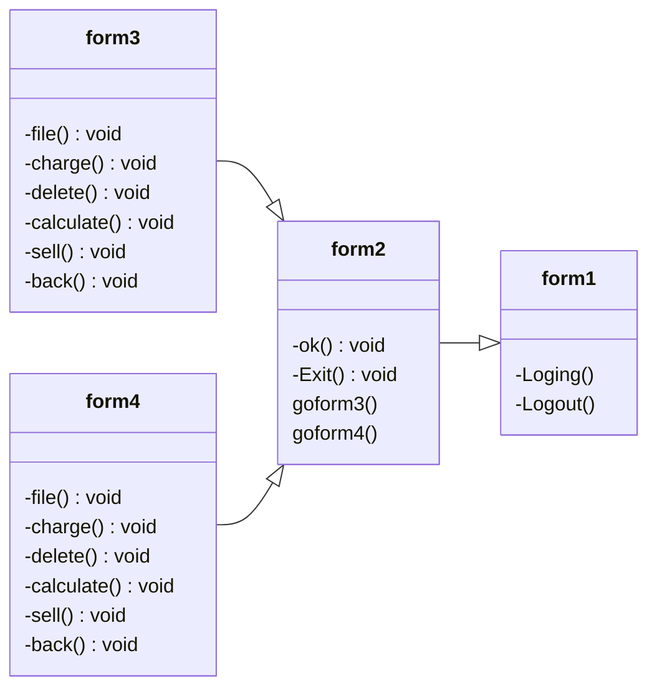

# Final-Project
ความเป็นมาของโปรแกรม
```
โปรแกรมนี้เกิดจากคิดไอเดียที่จะทำ โปรแกรมบันทึกการขาย เพราะทางบ้านของผม ครอบครัวทำอาชีพขายกับข้าวหน้าบ้าน 
ผมจึงได้เอาเมนูต่างๆมาใส่ในโปรแกรม โปรแกรมบันทึกการขายจะช่วยให้นับยอดการขายได้ง่ายขึ้น ผมจะพัฒนาโปรแกรมไปเรื่อยๆให้ที่บ้านได้มีโปรแกรมดีๆได้ใช่ครับ 
```
วัตถุประสงค์ของโปรแกรม
```
วัตถุประสงค์ของโปรแกรมนี้สร้างขึ้นเพื่อที่จะบันทึกว่ามีการขายข้าว-น้ำได้เท่าไหร่ในเเต่ละวัน

```
Class Diagram

เจ้าของโปรแกรมบันทึกการขาย
```นาย วิญญู พรมภิภักดิ์ 643450084-0```
